> [!warning]
> 好像最近项目中用来请求每日热点新闻的api接口被ban了，可以自己部署一下[newsnow](https://github.com/ourongxing/newsnow)，很快的可以一键部署，然后替换掉这个URL即可，最近一个月我也会commit一版更通用的解决方案。
> ```python
> #新闻API基础URL
> BASE URL = "https://newsnow.busiyi.world"
> ```

# MindSpider - 专为舆情分析设计的AI爬虫


> 免责声明：
> 本仓库的所有内容仅供学习和参考之用，禁止用于商业用途。任何人或组织不得将本仓库的内容用于非法用途或侵犯他人合法权益。本仓库所涉及的爬虫技术仅用于学习和研究，不得用于对其他平台进行大规模爬虫或其他非法行为。对于因使用本仓库内容而引起的任何法律责任，本仓库不承担任何责任。使用本仓库的内容即表示您同意本免责声明的所有条款和条件。

## 项目概述

MindSpider是一个基于Agent技术的智能舆情爬虫系统，通过AI自动识别热点话题，并在多个社交媒体平台进行精准的内容爬取。系统采用模块化设计，能够实现从话题发现到内容收集的全自动化流程。

项目参考知名爬虫MediaCrawler，在其基础上进行改进，实现全自动AI爬取：https://github.com/NanmiCoder/MediaCrawler

两步走爬取：

- 模块一：Search Agent从包括微博、知乎、github、酷安等 **13个** 社媒平台、技术论坛识别热点新闻，并维护一个每日话题分析表。
- 模块二：全平台爬虫深度爬取每个话题的细粒度舆情反馈。

### 技术架构

- **编程语言**: Python 3.9+
- **AI框架**: 默认Deepseek，可以接入多种api (话题提取与分析)
- **爬虫框架**: Playwright (浏览器自动化)
- **数据库**: MySQL (数据持久化存储)
- **并发处理**: AsyncIO (异步并发爬取)

## 项目结构

```
MindSpider/
├── BroadTopicExtraction/           # 话题提取模块
│   ├── database_manager.py         # 数据库管理器
│   ├── get_today_news.py          # 新闻采集器
│   ├── main.py                    # 模块主入口
│   └── topic_extractor.py         # AI话题提取器
│
├── DeepSentimentCrawling/         # 深度爬取模块
│   ├── keyword_manager.py         # 关键词管理器
│   ├── main.py                   # 模块主入口
│   ├── platform_crawler.py       # 平台爬虫管理器
│   └── MediaCrawler/             # 多平台爬虫核心
│       ├── base/                 # 基础类
│       ├── cache/                # 缓存系统
│       ├── config/               # 配置文件
│       ├── media_platform/       # 各平台实现
│       │   ├── bilibili/        # B站爬虫
│       │   ├── douyin/          # 抖音爬虫
│       │   ├── kuaishou/        # 快手爬虫
│       │   ├── tieba/           # 贴吧爬虫
│       │   ├── weibo/           # 微博爬虫
│       │   ├── xhs/             # 小红书爬虫
│       │   └── zhihu/           # 知乎爬虫
│       ├── model/               # 数据模型
│       ├── proxy/               # 代理管理
│       ├── store/               # 存储层
│       └── tools/               # 工具集
│
├── schema/                       # 数据库架构
│   ├── db_manager.py            # 数据库管理
│   ├── init_database.py         # 初始化脚本
│   └── mindspider_tables.sql    # 表结构定义
│
├── config.py                    # 全局配置文件
├── main.py                      # 系统主入口
├── requirements.txt             # 依赖列表
└── README.md                    # 项目文档
```

## 系统工作流程

### 整体架构流程图

```mermaid
flowchart TB
    Start[开始] --> CheckConfig{检查配置}
    CheckConfig -->|配置无效| ConfigError[配置错误<br/>请检查config.py]
    CheckConfig -->|配置有效| InitDB[初始化数据库]
    
    InitDB --> BroadTopic[BroadTopicExtraction<br/>话题提取模块]
    
    BroadTopic --> CollectNews[收集热点新闻]
    CollectNews --> |多平台采集| NewsSource{新闻源}
    NewsSource --> Weibo[微博热搜]
    NewsSource --> Zhihu[知乎热榜]
    NewsSource --> Bilibili[B站热门]
    NewsSource --> Toutiao[今日头条]
    NewsSource --> Other[其他平台...]
    
    Weibo --> SaveNews[保存新闻到数据库]
    Zhihu --> SaveNews
    Bilibili --> SaveNews
    Toutiao --> SaveNews
    Other --> SaveNews
    
    SaveNews --> ExtractTopic[AI话题提取]
    ExtractTopic --> |DeepSeek API| GenerateKeywords[生成关键词列表]
    GenerateKeywords --> GenerateSummary[生成新闻摘要]
    GenerateSummary --> SaveTopics[保存话题数据]
    
    SaveTopics --> DeepCrawl[DeepSentimentCrawling<br/>深度爬取模块]
    
    DeepCrawl --> LoadKeywords[加载关键词]
    LoadKeywords --> PlatformSelect{选择爬取平台}
    
    PlatformSelect --> XHS[小红书爬虫]
    PlatformSelect --> DY[抖音爬虫]
    PlatformSelect --> KS[快手爬虫]
    PlatformSelect --> BILI[B站爬虫]
    PlatformSelect --> WB[微博爬虫]
    PlatformSelect --> TB[贴吧爬虫]
    PlatformSelect --> ZH[知乎爬虫]
    
    XHS --> Login{需要登录?}
    DY --> Login
    KS --> Login
    BILI --> Login
    WB --> Login
    TB --> Login
    ZH --> Login
    
    Login -->|是| QRCode[扫码登录]
    Login -->|否| Search[关键词搜索]
    QRCode --> Search
    
    Search --> CrawlContent[爬取内容]
    CrawlContent --> ParseData[解析数据]
    ParseData --> SaveContent[保存到数据库]
    
    SaveContent --> MoreKeywords{还有更多关键词?}
    MoreKeywords -->|是| LoadKeywords
    MoreKeywords -->|否| GenerateReport[生成爬取报告]
    
    GenerateReport --> End[结束]
    
    style Start fill:#90EE90
    style End fill:#FFB6C1
    style BroadTopic fill:#87CEEB,stroke:#000,stroke-width:3px
    style DeepCrawl fill:#DDA0DD,stroke:#000,stroke-width:3px
    style ExtractTopic fill:#FFD700
    style ConfigError fill:#FF6347
```



### 工作流程说明

#### 1. BroadTopicExtraction（话题提取模块）

该模块负责每日热点话题的自动发现和提取：

1. **新闻采集**：从多个主流平台（微博、知乎、B站等）自动采集热点新闻
2. **AI分析**：使用DeepSeek API对新闻进行智能分析
3. **话题提取**：自动识别热点话题并生成相关关键词
4. **数据存储**：将话题和关键词保存到MySQL数据库

#### 2. DeepSentimentCrawling（深度爬取模块）

基于提取的话题关键词，在各大社交平台进行深度内容爬取：

1. **关键词加载**：从数据库读取当日提取的关键词
2. **平台爬取**：使用Playwright在7大平台进行自动化爬取
3. **内容解析**：提取帖子、评论、互动数据等
4. **情感分析**：对爬取内容进行情感倾向分析
5. **数据持久化**：将所有数据结构化存储到数据库

## 数据库架构

### 核心数据表

1. **daily_news** - 每日新闻表
   - 存储从各平台采集的热点新闻
   - 包含标题、链接、描述、排名等信息

2. **daily_topics** - 每日话题表
   - 存储AI提取的话题和关键词
   - 包含话题名称、描述、关键词列表等

3. **topic_news_relation** - 话题新闻关联表
   - 记录话题与新闻的关联关系
   - 包含关联度得分

4. **crawling_tasks** - 爬取任务表
   - 管理各平台的爬取任务
   - 记录任务状态、进度、结果等

5. **平台内容表**（继承自MediaCrawler）
   - xhs_note - 小红书笔记
   - douyin_aweme - 抖音视频
   - kuaishou_video - 快手视频
   - bilibili_video - B站视频
   - weibo_note - 微博帖子
   - tieba_note - 贴吧帖子
   - zhihu_content - 知乎内容
   - youtube_video - YouTube视频（字幕/转写）

## 安装部署

### 环境要求

- Python 3.9 或更高版本
- MySQL 5.7 或更高版本
- Conda环境：pytorch_python11（推荐）
- 操作系统：Windows/Linux/macOS

### 1. 克隆项目

```bash
git clone https://github.com/yourusername/MindSpider.git
cd MindSpider
```

### 2. 创建并激活Conda环境

```bash
conda create -n pytorch_python11 python=3.11
conda activate pytorch_python11
```

### 3. 安装依赖

```bash
# 安装Python依赖
pip install -r requirements.txt

# 安装Playwright浏览器驱动
playwright install
```

### 4. 配置系统

编辑 `config.py` 文件，设置数据库和API配置：

```python
# MySQL数据库配置
DB_HOST = "your_database_host"
DB_PORT = 3306
DB_USER = "your_username"
DB_PASSWORD = "your_password"
DB_NAME = "mindspider"
DB_CHARSET = "utf8mb4"

# DeepSeek API密钥
DEEPSEEK_API_KEY = "your_deepseek_api_key"
```

### 5. 初始化系统

```bash
# 检查系统状态
python main.py --status

# 初始化数据库表
python main.py --setup
```

## 使用指南

### 完整流程

```bash
# 1. 运行话题提取（获取热点新闻和关键词）
python main.py --broad-topic

# 2. 运行爬虫（基于关键词爬取各平台内容）
python main.py --deep-sentiment --test

# 或者一次性运行完整流程
python main.py --complete --test
```

### 单独使用模块

```bash
# 只获取今日热点和关键词
python main.py --broad-topic

# 只爬取特定平台
python main.py --deep-sentiment --platforms xhs dy --test

# 指定日期
python main.py --broad-topic --date 2024-01-15
```

## 爬虫配置（重要）

### 平台登录配置

**首次使用每个平台都需要登录，这是最关键的步骤：**

1. **小红书登录**
```bash
# 测试小红书爬取（会弹出二维码）
python main.py --deep-sentiment --platforms xhs --test
# 用小红书APP扫码登录，登录成功后会自动保存状态
```

2. **抖音登录**
```bash
# 测试抖音爬取
python main.py --deep-sentiment --platforms dy --test
# 用抖音APP扫码登录
```

3. **其他平台同理**
```bash
# 快手
python main.py --deep-sentiment --platforms ks --test

# B站
python main.py --deep-sentiment --platforms bili --test

# 微博
python main.py --deep-sentiment --platforms wb --test

# 贴吧
python main.py --deep-sentiment --platforms tieba --test

# 知乎
python main.py --deep-sentiment --platforms zhihu --test

# YouTube（无需登录；优先抓取字幕/自动字幕）
python main.py --deep-sentiment --platforms yt --test
# 代理：编辑 DeepSentimentCrawling/MediaCrawler/config/youtube_config.py 的 YOUTUBE_PROXY，或设置环境变量 HTTP_PROXY/HTTPS_PROXY
```

### 登录问题排除

**如果登录失败或卡住：**

1. **检查网络**：确保能正常访问对应平台
2. **关闭无头模式**：编辑 `DeepSentimentCrawling/MediaCrawler/config/base_config.py`
   ```python
   HEADLESS = False  # 改为False，可以看到浏览器界面
   ```
3. **手动处理验证**：有些平台可能需要手动滑动验证码
4. **重新登录**：删除 `DeepSentimentCrawling/MediaCrawler/browser_data/` 目录重新登录

### 爬取参数调整

在实际使用前建议调整爬取参数：

```bash
# 小规模测试（推荐先这样测试）
python main.py --complete --test

# 调整爬取数量
python main.py --complete --max-keywords 20 --max-notes 30
```

### 高级功能

#### 1. 指定日期操作
```bash
# 提取指定日期的话题
python main.py --broad-topic --date 2024-01-15

# 爬取指定日期的内容
python main.py --deep-sentiment --date 2024-01-15
```

#### 2. 指定平台爬取
```bash
# 只爬取小红书和抖音
python main.py --deep-sentiment --platforms xhs dy --test

# 爬取所有平台的特定数量内容
python main.py --deep-sentiment --max-keywords 30 --max-notes 20
```

## 常用参数

```bash
--status              # 检查项目状态
--setup               # 初始化项目
--broad-topic         # 话题提取
--deep-sentiment      # 爬虫模块
--complete            # 完整流程
--test                #测试模式（少量数据）
--platforms xhs dy    # 指定平台
--date 2024-01-15     # 指定日期
```

## 定时调度器（Scheduler）

### 功能概述

MindSpider提供了一个生产级的定时调度器，用于**自动化周期性爬取内容创作者的最新发布内容**。适用场景：

- 🔄 监控特定KOL/创作者的持续更新
- 📊 建立长期的舆情数据库
- 🚀 实现增量爬取，避免重复处理
- ⏰ 24/7无人值守运行

### 特性亮点

✅ **智能去重**：单条检测，遇到已存在内容立即停止  
✅ **自动清理**：每次任务后自动关闭浏览器和数据库连接  
✅ **容错机制**：异常后自动恢复，不影响后续任务  
✅ **多平台支持**：目前支持抖音(dy)和YouTube(yt)  
✅ **配置灵活**：可自定义爬取间隔和目标创作者  

### 快速开始

#### 1. 配置创作者列表

**抖音（Douyin）**

编辑 `DeepSentimentCrawling/MediaCrawler/config/dy_config.py`:

```python
# 指定抖音用户ID列表（支持短链接或sec_uid）
DY_CREATOR_ID_LIST = [
    "https://v.douyin.com/h_jxidKie7g/",  # 短链接
    "https://v.douyin.com/mp5dWB323NE/", 
    # 或直接使用 sec_uid
    "MS4wLjABAAAA3GSIH7t0qsmwWzdxKG2hZ9tnRqeurpqpzbhOAICrPnA",
]
```

**YouTube**

编辑 `DeepSentimentCrawling/MediaCrawler/config/youtube_config.py`:

```python
# 指定YouTube频道URL列表
YT_CREATOR_ID_LIST = [
    "https://www.youtube.com/@小左美股第一视角/videos",
    "https://www.youtube.com/@GoogleDeepMind",
    "https://www.youtube.com/@OpenAI",
]
```

#### 2. 设置爬取间隔

编辑 `DeepSentimentCrawling/MediaCrawler/.env`:

```bash
# 设置爬取间隔（秒），默认3600（1小时）
SCHEDULE_INTERVAL=3600

# 其他示例：
# SCHEDULE_INTERVAL=1800   # 30分钟
# SCHEDULE_INTERVAL=7200   # 2小时
# SCHEDULE_INTERVAL=86400  # 24小时
```

#### 3. 启动调度器

```bash
cd DeepSentimentCrawling/MediaCrawler
python scheduler.py
```

### 工作原理

```mermaid
flowchart TB
    Start[启动调度器] --> Init[初始化配置]
    Init --> Loop{开始循环}
    
    Loop --> DY[抖音任务]
    DY --> DY_Init[初始化数据库]
    DY_Init --> DY_Crawl[打开浏览器]
    DY_Crawl --> DY_Login{需要登录?}
    DY_Login -->|是| DY_QR[CDP模式/扫码]
    DY_Login -->|否| DY_Fetch[获取创作者视频列表]
    DY_QR --> DY_Fetch
    
    DY_Fetch --> DY_Check{检测单条视频}
    DY_Check -->|新视频| DY_Process[下载+转写+保存]
    DY_Process --> DY_Check
    DY_Check -->|已存在| DY_Stop[停止此创作者]
    DY_Stop --> DY_Clean[关闭浏览器+数据库]
    
    DY_Clean --> Sleep1[等5秒]
    Sleep1 --> YT[YouTube任务]
    
    YT --> YT_Init[初始化数据库]
    YT_Init --> YT_Fetch[获取频道视频列表]
    YT_Fetch --> YT_Check{检测单条视频}
    YT_Check -->|新视频| YT_Process[字幕提取+保存]
    YT_Process --> YT_Check
    YT_Check -->|已存在| YT_Stop[停止此频道]
    YT_Stop --> YT_Clean[关闭数据库]
    
    YT_Clean --> Sleep2[等待下一周期]
    Sleep2 --> Loop
    
    style Start fill:#90EE90
    style DY fill:#87CEEB
    style YT fill:#FFB6C1
    style DY_Stop fill:#FFD700
    style YT_Stop fill:#FFD700
```



### 核心机制说明

#### 1. 智能增量爬取

调度器实现了**逐条检测**的去重策略：

```python
# 伪代码示例
for video in creator_videos:
    if exists_in_database(video.id):
        log("遇到已存在视频，停止")
        break  # 立即停止！
    else:
        download_and_save(video)
```

**优势**：
- 假设创作者发布了5个新视频
- 传统方式：获取全部 → 批量检测 → 过滤重复（浪费API调用）
- 智能方式：检测第1个 ✓ → 检测第2个 ✓ → ... → 检测第6个 ✗ 停止！

#### 2. 资源管理

每次任务完成后，**必定**执行清理：

```python
try:
    # 爬取逻辑
    await crawler.start()
finally:
    # 无论成功失败，都会执行
    await crawler.close()      # 关闭浏览器
    await db.close()           # 关闭数据库
    await shutdown_caches()    # 清理缓存
```

#### 3. 平台配置

调度器默认爬取两个平台，可在 `scheduler.py` 中修改：

```python
# 修改这一行来调整爬取的平台
PLATFORMS_TO_CRAWL = ["dy", "yt"]  

# 可选值："xhs", "dy", "ks", "bili", "wb", "tieba", "zhihu", "yt"
```

### 监控和日志

#### 查看运行日志

调度器运行时会输出详细日志：

```log
2025-12-24 15:50:14 MediaCrawler INFO [dy] >>> Starting periodic crawl task
2025-12-24 15:50:14 MediaCrawler INFO [dy] Initializing database connection...
2025-12-24 15:50:15 MediaCrawler INFO [dy] Creating crawler instance...
2025-12-24 15:50:18 MediaCrawler INFO [DouYinCrawler] Found new video 7587314631517998377 (1/10)
2025-12-24 15:50:20 MediaCrawler INFO [DouYinCrawler] Found new video 7587311995520503082 (2/10)
2025-12-24 15:50:22 MediaCrawler INFO [DouYinCrawler] Encountered existing video 7586999999 in DB. Stopping
2025-12-24 15:50:23 MediaCrawler INFO [dy] Closing crawler...
2025-12-24 15:50:23 MediaCrawler INFO [dy] Database connection closed
2025-12-24 15:50:23 MediaCrawler INFO [dy] <<< Finished periodic crawl task
```

#### 关键日志指标

| 日志关键词 | 含义 |
|----------|------|
| `Found new video` | 发现新内容 |
| `Encountered existing video` | 遇到重复，触发停止 |
| `Processing X new videos` | 开始处理X个新视频 |
| `Crawler closed successfully` | 浏览器正常关闭 |
| `Full cycle complete in Xs` | 完整周期耗时 |

### 生产环境部署

#### 使用systemd（Linux）

创建服务文件 `/etc/systemd/system/mindspider-scheduler.service`:

```ini
[Unit]
Description=MindSpider Periodic Scheduler
After=network.target mysql.service

[Service]
Type=simple
User=your_user
WorkingDirectory=/path/to/MindSpider/DeepSentimentCrawling/MediaCrawler
Environment="PATH=/home/your_user/miniconda3/envs/pytorch_python11/bin"
ExecStart=/home/your_user/miniconda3/envs/pytorch_python11/bin/python scheduler.py
Restart=always
RestartSec=10

[Install]
WantedBy=multi-user.target
```

启动服务：

```bash
sudo systemctl daemon-reload
sudo systemctl enable mindspider-scheduler
sudo systemctl start mindspider-scheduler

# 查看状态
sudo systemctl status mindspider-scheduler

# 查看日志
sudo journalctl -u mindspider-scheduler -f
```

#### 使用screen（快速方案）

```bash
# 创建后台会话
screen -S mindspider

# 进入MediaCrawler目录
cd DeepSentimentCrawling/MediaCrawler

# 启动调度器
python scheduler.py

# 按 Ctrl+A 然后按 D 分离会话

# 重新连接
screen -r mindspider
```

### 常见问题

#### Q: 如何停止调度器？
**A**: 按 `Ctrl+C` 或发送 SIGINT 信号。调度器会优雅退出。

#### Q: 调度器崩溃了怎么办？
**A**: 调度器会自动从下一个周期恢复。建议配合systemd使用，实现自动重启。

#### Q: 如何只监控某个创作者？
**A**: 在配置文件中只保留该创作者的ID/URL即可。

#### Q: 可以同时监控100个创作者吗？
**A**: 可以，但建议：
- 调整 `CRAWLER_MAX_NOTES_COUNT` 为较小值（如5）
- 增加 `SCHEDULE_INTERVAL`（如每4小时）
- 监控数据库性能

#### Q: YouTube需要代理吗？
**A**: 
- 国内需要设置代理
- 方法1：编辑 `config/youtube_config.py` 设置 `YOUTUBE_PROXY`
- 方法2：设置环境变量 `HTTP_PROXY` 和 `HTTPS_PROXY`

### 高级配置

#### 调整单个创作者的爬取数量

编辑 `DeepSentimentCrawling/MediaCrawler/config/base_config.py`:

```python
# 每个创作者最多爬取多少条新内容
CRAWLER_MAX_NOTES_COUNT = 10  # 建议5-20
```

#### 禁用特定平台

修改 `scheduler.py`:

```python
# 只爬YouTube
PLATFORMS_TO_CRAWL = ["yt"]

# 只爬抖音
PLATFORMS_TO_CRAWL = ["dy"]
```

#### 启用CDP模式（抖音推荐）

编辑 `DeepSentimentCrawling/MediaCrawler/config/base_config.py`:

```python
ENABLE_CDP_MODE = True  # 使用本地Chrome浏览器
CDP_HEADLESS = False    # 是否无头模式
AUTO_CLOSE_BROWSER = True  # 任务后自动关闭
```

### 性能建议

| 创作者数量 | 建议间隔 | 单次爬取量 |
|---------|---------|-----------|
| 1-10 | 1小时 | 10条 |
| 10-50 | 2-4小时 | 5条 |
| 50-100 | 6-12小时 | 3条 |
| 100+ | 24小时 | 1-2条 |

---

## 支持的平台


| 代码 | 平台 | 代码 | 平台 |
|-----|-----|-----|-----|
| xhs | 小红书 | wb | 微博 |
| dy | 抖音 | tieba | 贴吧 |
| ks | 快手 | zhihu | 知乎 |
| bili | B站 | | |

## 常见问题

### 1. 爬虫登录失败
```bash
# 问题：二维码不显示或登录失败
# 解决：关闭无头模式，手动登录
# 编辑：DeepSentimentCrawling/MediaCrawler/config/base_config.py
HEADLESS = False

# 重新运行登录
python main.py --deep-sentiment --platforms xhs --test
```

### 2. 数据库连接失败
```bash
# 检查配置
python main.py --status

# 检查config.py中的数据库配置是否正确
```

### 3. playwright安装失败
```bash
# 重新安装
pip install playwright
playwright install
```

### 4. 爬取数据为空
- 确保平台已经登录成功
- 检查关键词是否存在（先运行话题提取）
- 使用测试模式验证：`--test`

### 5. API调用失败
- 检查DeepSeek API密钥是否正确
- 确认API额度是否充足

## 注意事项

1. **首次使用必须先登录各平台**
2. **建议先用测试模式验证**
3. **遵守平台使用规则**
4. **仅供学习研究使用**

## 项目开发指南

### 扩展新的新闻源

在 `BroadTopicExtraction/get_today_news.py` 中添加新的新闻源：

```python
async def get_new_platform_news(self) -> List[Dict]:
    """获取新平台的热点新闻"""
    # 实现新闻采集逻辑
    pass
```

### 扩展新的爬虫平台

1. 在 `DeepSentimentCrawling/MediaCrawler/media_platform/` 下创建新平台目录
2. 实现平台的核心功能模块：
   - `client.py`: API客户端
   - `core.py`: 爬虫核心逻辑
   - `login.py`: 登录逻辑
   - `field.py`: 数据字段定义

### 数据库扩展

如需添加新的数据表或字段，请更新 `schema/mindspider_tables.sql` 并运行：

```bash
python schema/init_database.py
```

## 性能优化建议

1. **数据库优化**
   - 定期清理历史数据
   - 为高频查询字段建立索引
   - 考虑使用分区表管理大量数据

2. **爬取优化**
   - 合理设置爬取间隔避免被限制
   - 使用代理池提高稳定性
   - 控制并发数避免资源耗尽

3. **系统优化**
   - 使用Redis缓存热点数据
   - 异步任务队列处理耗时操作
   - 定期监控系统资源使用

## API接口说明

系统提供Python API供二次开发：

```python
from BroadTopicExtraction import BroadTopicExtraction
from DeepSentimentCrawling import DeepSentimentCrawling

# 话题提取
async def extract_topics():
    extractor = BroadTopicExtraction()
    result = await extractor.run_daily_extraction()
    return result

# 内容爬取
def crawl_content():
    crawler = DeepSentimentCrawling()
    result = crawler.run_daily_crawling(
        platforms=['xhs', 'dy'],
        max_keywords=50,
        max_notes=30
    )
    return result
```

## 许可证

本项目仅供学习研究使用，请勿用于商业用途。使用本项目时请遵守相关法律法规和平台服务条款。

---

**MindSpider** - 让AI助力舆情洞察，智能化内容分析的得力助手
